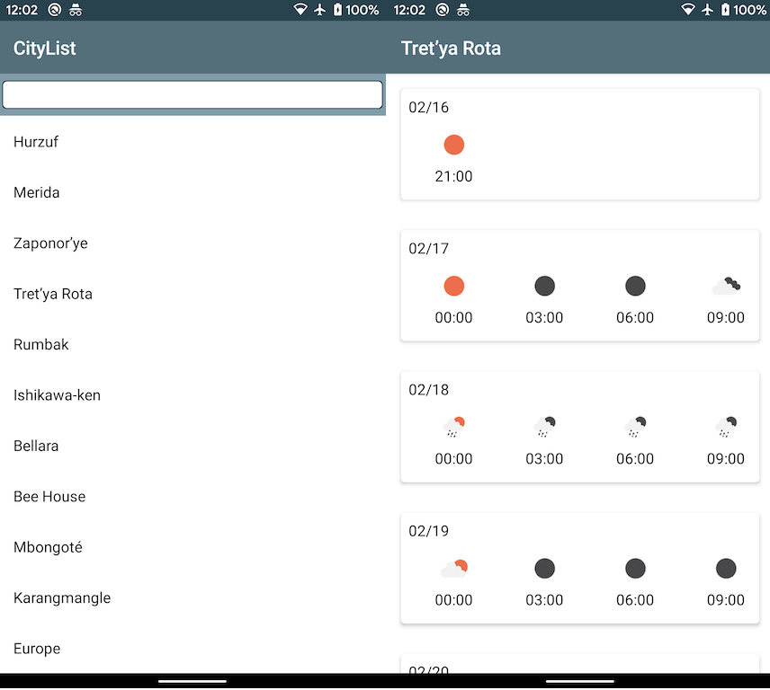

# Jetpack Compose Weather Sample

## Summary

Weather app example using `Jetpack Compose`.

## Features

* Fully Jetpack Compose
* Using `+state` and `+model`, combined Kotlin-Coroutine
* Custom theme

## How to run

1. get API key from open weather
2. Write API key to local.properties file, `api_key=[YOUR_KEY]`
3. Install [Android Studio 4.0 Preview](https://developer.android.com/studio/preview)
4. download project
5. read Project

## Limitations

* Weather icons used in this app are localed in `resources`.
  * I couldn't find the way to create image from network.
* AndroidStudio's component-preview doesn't work well.

